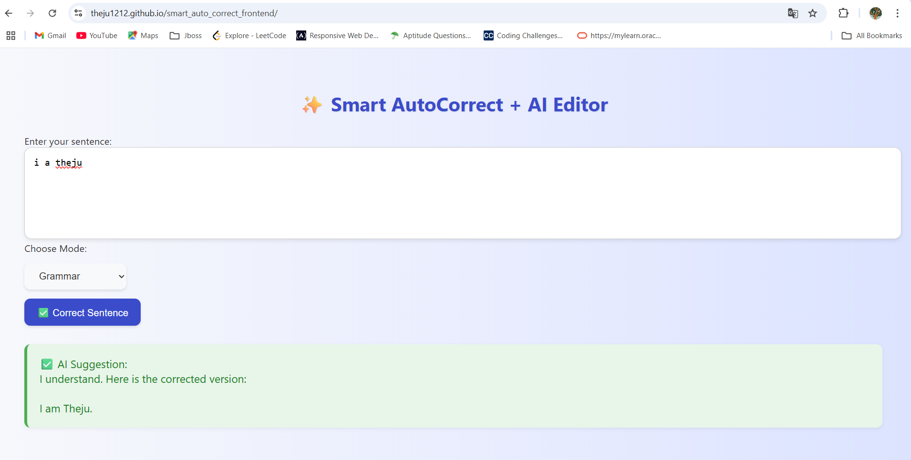

# 🚀 Smart Auto-Correct ✨  
AI-powered text corrector & tone transformer — corrects grammar, fixes typos, and transforms tone with a single click!

[🔗 Backend (Render)](https://smart-auto-correct.onrender.com)  
[🔗 Frontend (GitHub Pages)](https://Theju1212.github.io/smart_auto_correct_frontend)  
[💻 GitHub Repo (Full Project)](https://github.com/Theju1212/smart_auto_correct)

---

## ✨ Features

- ✅ **Grammar correction**
- ✅ **Spelling & sentence fixes**
- ✅ **Smart tone transformation modes**:
  - Grammar fix
  - Polite tone
  - Expand sentences
  - Shorten text
  - Make it more confident
- ✅ **Handles typos intelligently**
- ✅ **Simple UI + Fast response**
- ✅ **Claude-3 Haiku (OpenRouter API)**

---

## 🌐 Live Preview

> 🔗 Try it now: [https://Theju1212.github.io/smart_auto_correct_frontend](https://Theju1212.github.io/smart_auto_correct_frontend)

---

## 🎯 Tone Modes & Examples

### 🔤 Grammar Mode
Fixes spelling, grammar, and sentence structure.

**Input:**  
`ma od less ou`  
**Output:**  
`May God bless you`

**Input:**  
`this are good ideaa`  
**Output:**  
`This is a good idea.`

---

### 🙏 Polite Mode

**Input:**  
`Send me the files now`  
**Output:**  
`Could you please send me the files at your earliest convenience?`

**Input:**  
`What are you doing?`  
**Output:**  
`May I ask what you're doing right now?`

---

### 💬 Expand Mode

**Input:**  
`Thank you`  
**Output:**  
`Thank you so much! I truly appreciate your help.`

**Input:**  
`Meeting was fine`  
**Output:**  
`The meeting went well, and we discussed some key points moving forward.`

---

### ✂️ Shorten Mode

**Input:**  
`I would really like it if you could please explain this topic once again in detail`  
**Output:**  
`Please explain this topic again.`

**Input:**  
`Can you please send the documents as soon as possible because we have to submit it today`  
**Output:**  
`Please send the documents quickly; submission is today.`

---

### 💪 Confident Mode

**Input:**  
`I think I might be able to handle this task`  
**Output:**  
`I can handle this task confidently.`

**Input:**  
`Maybe we could try a different solution?`  
**Output:**  
`Let’s try a different solution.`

---

## 🛠 Tech Stack

**Frontend**:  
- HTML, CSS, JavaScript  
- GitHub Pages for hosting

**Backend**:  
- Python Flask  
- Flask-CORS  
- Render for deployment  
- OpenRouter Claude-3 API

---

## 📁 Project Structure

smart_auto_correct/
├── backend/
│ ├── app.py
│ └── requirements.txt
│
└── frontend/
├── index.html
├── style.css
└── script.js

